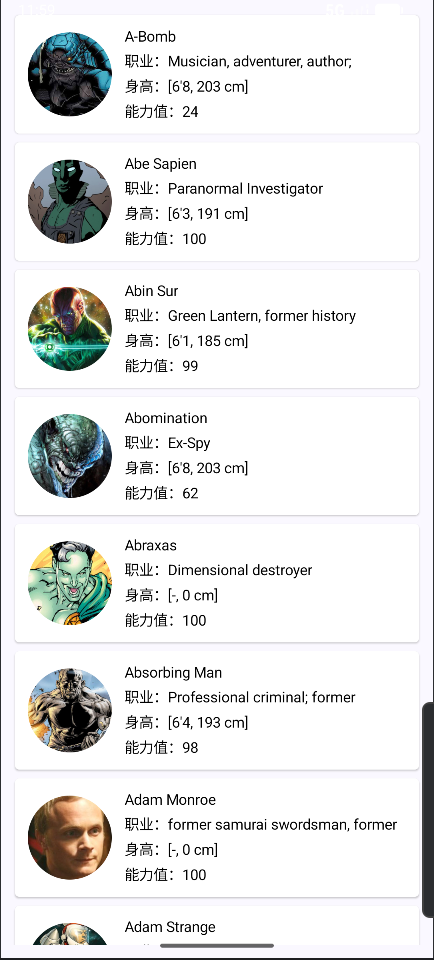
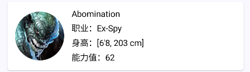
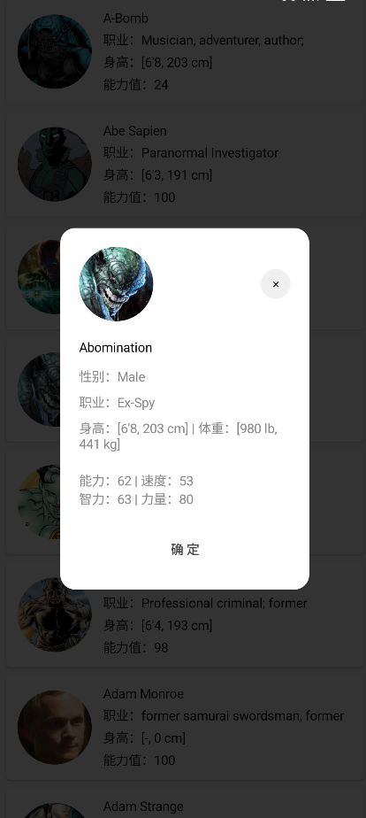
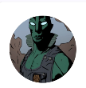
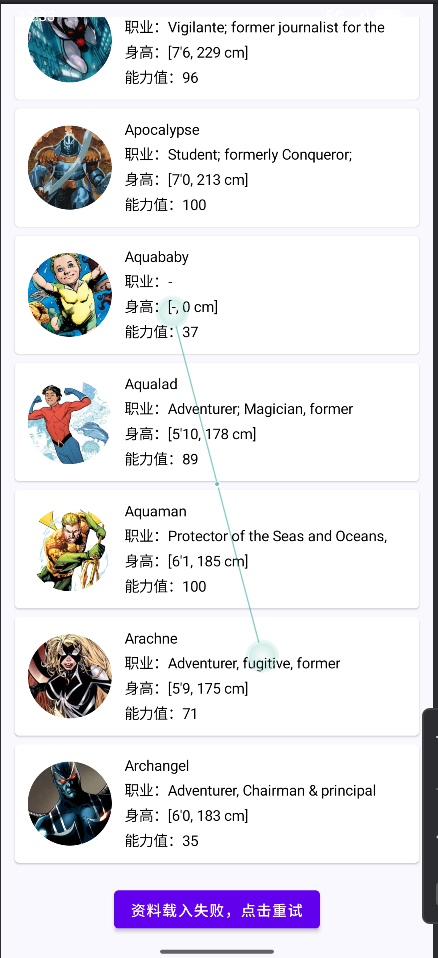
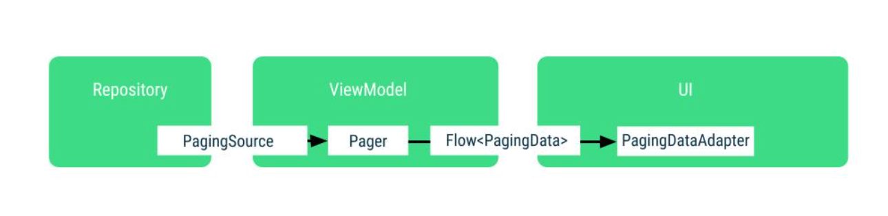

### SuperHeroDemo
    用SuperHero API 实现一个英雄列表、用Compose + MVVM实现，使用协程+ Retrofit 支持分页。

### Getting your Access Token
    代码中的Token已经过期，需要自己申请。
    You need a GitHub account to get your access token. You can generate your access token below
    申请后【https://www.superheroapi.com/】，赋值给 SuperHeroConfig.ACCESS_TOKEN

### 1 需求
#### 1.1 需求基本信息
+ 使用 Android Studio 和 Kotlin。
+ 使用 SuperHero API 來獲取角色資料。
+ 設計簡單的界面,以展示API回傳的角色資料。
+ 必須使用MVVM,Jetpack Compose

#### 1.2 需求概述及关键点&需求反讲
+ 获取展示超级英雄列表

+ 列表展示超級英雄們的名字,以及各種屬性(如身高,職業,能力值)

+ (可選)允許用戶點擊角色以查看更多詳細資訊

+ 載入圖片:利用第三方庫載入角色圖片

+ 分頁:實現分頁加載,以避免一次載入全部角色。
+ 錯誤處理:API請求失敗時,提供使用者友善的提示訊息(例如:「未找到結果」或「資料載入失敗」)。

+ 測試:撰寫關鍵元件(如 ViewModel 或 Repository)的單元測試,雖非必須。

### 2 技术方案
#### 2.1 整体方案设计
    整体采用MVVM框架，实现view与model分离，
    model层：API用retrofit封装，Repository使用Paging组件实现分页接口能力
    view组件用compose实现：英雄列表、英雄头像、英雄列表Item、英雄详情弹窗以及LoadingItem和ErrorItem
    viewModel层：Pager创建Flow并通过cacheIn共享缓存并绑定生命周期

#### 2.2 详细设计


#### 2.3 接口设计
     BASE_URL = "https://superheroapi.com/api/${ACCESS_TOKEN}/"
+ 根据id查询英雄信息

  Purpose: Search by character id. Returns all information of the character.

  Reference: /{id}

  Method: GET

  Response: JSON
```json
{
    "response": "success",
    "id": "70",
    "name": "Batman",
    "powerstats": {
        "intelligence": "100",
        "strength": "26",
        "speed": "27",
        "durability": "50",
        "power": "47",
        "combat": "100"
    },
    "biography": {
        "full-name": "Bruce Wayne",
        "alter-egos": "No alter egos found.",
        "aliases": [
        "Insider",
        "Matches Malone"
        ],
        "place-of-birth": "Crest Hill, Bristol Township; Gotham County",
        "first-appearance": "Detective Comics #27",
        "publisher": "DC Comics",
        "alignment": "good"
    },
    "appearance": {
        "gender": "Male",
        "race": "Human",
        "height": [
        "6'2",
        "188 cm"
        ],
        "weight": [
        "210 lb",
        "95 kg"
        ],
        "eye-color": "blue",
        "hair-color": "black"
    },
    "work": {
        "occupation": "Businessman",
        "base": "Batcave, Stately Wayne Manor, Gotham City; Hall of Justice, Justice League Watchtower"
    },
    "connections": {
        "group-affiliation": "Batman Family, Batman Incorporated, Justice League, Outsiders, Wayne Enterprises, Club of Heroes, formerly White Lantern Corps, Sinestro Corps",
        "relatives": "Damian Wayne (son), Dick Grayson (adopted son), Tim Drake (adopted son), Jason Todd (adopted son), Cassandra Cain (adopted ward)\nMartha Wayne (mother, deceased), Thomas Wayne (father, deceased), Alfred Pennyworth (former guardian), Roderick Kane (grandfather, deceased), Elizabeth Kane (grandmother, deceased), Nathan Kane (uncle, deceased), Simon Hurt (ancestor), Wayne Family"
    },
    "image": {
        "url": "httpss://www.superherodb.com/pictures2/portraits/10/100/639.jpg"
    }
}
```

#### 2.3 合规分析
由于请求英雄角色需要访问SuperHero API，app需要网络权限
```xml
<!-- 核心：允许应用访问网络（必加） -->
<uses-permission android:name="android.permission.INTERNET" />
```


